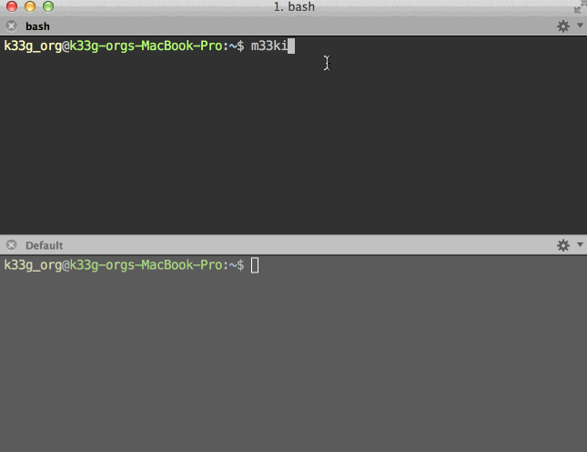

#M33ki

>>The !(not)Opinionated Web Framework

*M33ki Framework makes it easy to build web applications with Golo & Java.*

M33ki is based on a lightweight, stateless or stateful (as you want) , web-friendly architecture.

Built on Golo and SparkJava *(and some other libraries)*, M33ki provides minimal resource consumption (CPU, memory, threads) for embedded web server.

##Developer friendly.

Make your changes and simply hit refresh! All you need is a browser and a text editor.

###Getting started with Golo

###Getting started with Java

##Asynchronous model ... if you want

###Futures

###Promises

###Observers

##Modern web & mobile.

M33ki was built for needs of modern web & mobile apps.

- RESTful by default
- JSON is a first class citizen
- Websockets, EventSource (Server Sent Events)
- NoSQL (MongoDb & Redis)

##Install M33ki

###Dependencies

###Linux

###OSX

###Windows

##Extend your application

##Extend M33ki

###Jars

###Templates

##W.I.P.

- Documentation
- Front framework
- Generators

