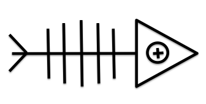

#M33ki



>>Web Stack, Golo powered for TypeUnSafe inc.

##What is M33ki?

M33ki is a set of Golo libraries (see `/libs` directory) using [SparkJava](http://www.sparkjava.com/), Jackson, MongoDb (and Redis) to create webapps quickly. 

##How to create your first M33ki application?

- Create a directory `<application_name>`
- Copy to `<application_name>` the 2 directories `jars` and `libs`
- You need a `public` directory to store static assets (html, javascript, ...)

At the root of the `<application_name>`, create a golo script, ie: `myapp.golo` with this code :

```coffeescript
    module myapp

    import m33ki.spark

    function main = |args| {

      port(8888)

      #Home page
      GET("/", |request, response| {
        response:type("text/HTML")

        return 
        """
          <!DOCTYPE html>
          <html>
          <head>
              <title>M33KI</title>
          </head>
          <body>
            <h1>Golo is awesome</h1>
            <hr>
            <a href="/other_page">An other page</a>
          </body>
        """
      })

      #An other page
      GET("/other_page", |request, response| {
        response:type("text/HTML")

        return 
        """
          <!DOCTYPE html>
          <html>
          <head>
              <title>M33KI</title>
          </head>
          <body>
            <h1>Hello World!</h1>
            <hr>
            <a href="/">Home page</a>
          </body>
        """
      })
    }
```

Run it :

    golo golo --classpath jars/*.jar --files libs/*.golo myapp.golo

Open your browser : [http://localhost:8888/](http://localhost:8888/)

##Create a JSON Services

```coffeescript
    module myapp

    import m33ki.spark
    import m33ki.jackson

    function main = |args| {

      port(8888)

      #Addition
      GET("/add/:a/:b", |request, response| {
        response:type("application/json")

        let result =  
            request: params(":a"):toInteger() 
          + request: params(":b"):toInteger()

        return Json(): toJsonString(map[["result", result]])
      })
    }
```

Open your browser : [http://localhost:8888/add/5/4](http://localhost:8888/add/5/4), and you'll obtain :

    {"result":9}


##Samples

###simple

A little sample with CRUD REST API. Type `golo golo --classpath jars/*.jar --files libs/*.golo samples/simple/simple.golo` to run it.

###simple.polymer

This is the same sample as "simple" sample but with **Polymer** framework for the front-end side. Type `golo golo --classpath jars/*.jar --files libs/*.golo samples/simple.polymer/simple.golo` to run it.

###sse

A very quick sample to play with **server sent events**. Type `golo golo --classpath jars/*.jar --files libs/*.golo samples/sse/sse.golo` to run it.

###futures

A little POC about Golo and Futures (WIP). Type `golo golo --classpath jars/*.jar --files libs/*.golo samples/futures/futures.golo` to run it.

###books

A little sample that runs with **MongoDb**. Launch MongoDb before (`mongod`), then type `golo golo --classpath jars/*.jar --files libs/*.golo samples/books/books.golo` to run it.

<hr>

##Components (currently)

- Spark
- Jackson
- MongoDb (java driver)
- Redis (jedis)

>>You can use the `pom.xml` provided to rebuild `m33ki.preview-N.N.jar` with this command : `mvn compile assembly:single`.

##Functionalities (currently)

- Routes / REST API
- Models and Collections + Mongo
- Server Web Events (Server Sent Events)
- Future (simple)

##Backlog

- Query helper 4 Mongo
- Redis (jedis)
- Scheduled Future
- Authentication (+ Cookies)
- Actors
- Error management
- ...
