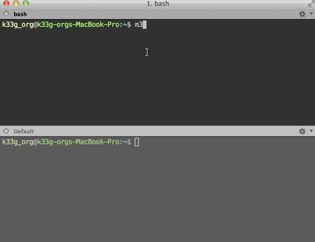

#M33ki

>>The !(not)Opinionated Web Framework

*M33ki Framework makes it easy to build web applications with Golo & Java.*

M33ki is based on a lightweight, stateless or stateful (as you want) , web-friendly architecture.

Built on Golo and SparkJava *(and some other libraries)*, M33ki provides minimal resource consumption (CPU, memory, threads) for embedded web server.

##Developer friendly.

Make your changes and simply hit refresh! All you need is a browser and a text editor.

###Getting started with Golo


###Getting started with Java



##Asynchronous model ... if you want

###Futures

```coffeescript
let future = Future(executor, |message, self| {
    self: result(0)
    println("You've got a message : " + message)
    42: times({
      self: result(self: result() + 1)
      java.lang.Thread.sleep(1000_L)
    })
    println(self: result())
  })
```

###Promises

```coffeescript
var result = DynamicObject(): value(0)

Promise(executor)
  : task(|arg| {
    println("promise argument is " + arg)
    let res = DynamicObject(): value(1)

    arg: times(|index| {
      res: value(res: value() * (index + 1))
      java.lang.Thread.sleep(500_L)
    })

    return res: value()
  })
  : success(|value| { # if success
      println("success : " + value)
      result: value(value)
  })
  : error(|error| { # on error
      println("error : " + error)
  })
  : always(|self| { # but always
      println("always : " + self: result())
  })
  : make(5) # arg
```

###Observers

```coffeescript
let dyno = DynamicObject(): info(""): total(0)

let observer = Observer(executor)
  : observable(dyno): delay(3000_L)
  : onChange(|currentValue, oldValue, thatObserver| {

      println("old : " + oldValue: info() + " " + oldValue: total())
      println("current : " + currentValue: info() + " " + currentValue: total())

    })
  : observe(["info", "total"])
```

##Modern web & mobile.

M33ki was built for needs of modern web & mobile apps.

- RESTful by default
- JSON is a first class citizen
- Websockets, EventSource (Server Sent Events)
- NoSQL (MongoDb & Redis)

###REST Example

```coffeescript
# Create a model
POST("/models", |request, response| {
  response: type("application/json")
  println(request: body())
  response: status(201) # 201: created
  return Json(): toJsonString(map[["message", "this is a POST request"]])
})

# Retrieve all models
GET("/models", |request, response| {
  response: type("application/json")
  return Json(): toJsonString(map[["message", "this is a GET request"]])
})

# Retrieve a model by id
GET("/models/:id", |request, response| {
  response: type("application/json")
  let id = request: params(":id")
  return Json(): toJsonString(map[["message", "this is a GET request with id="+id]])
})

# Update model
PUT("/models/:id", |request, response| {
  response: type("application/json")
  println(request: body())
  let id = request: params(":id")
  return Json(): toJsonString(map[["message", "this is a PUT request with id="+id]])
})

# Delete model
DELETE("/models/:id", |request, response| {
  response: type("application/json")
  let id = request: params(":id")
  return Json(): toJsonString(map[["message", "this is a DELETE request with id="+id]])
})
```

##Install M33ki

###Dependencies

You have to install Golo and set GOLO_HOME to PATH

###Linux

    # 1- clone m33ki repository in a directory
    git clone https://github.com/TypeUnsafe/m33ki.git

    # 2- edit .bashrc
    pico ~/.bashrc

    # 3- Then :
    export GOLO_HOME="$HOME/golo-directory/"
    export PATH=$PATH:$GOLO_HOME/bin

    export PATH=$PATH:$HOME/directory/m33ki

###OSX

    # 1- clone m33ki repository in a directory
    git clone https://github.com/TypeUnsafe/m33ki.git

    # 2- edit .bash_profile
    sudo pico ~/.bash_profile

    # 3- Then :
    GOLO_HOME=/golo-directory/
    export GOLO_HOME
    export PATH=$PATH:$GOLO_HOME/bin

    M33KI_HOME=/directory/m33ki
    export M33KI_HOME
    export PATH=$PATH:$M33KI_HOME

###Windows

  Set System Variables in Configuration Panel.

##Create an application

- run console : type `m33ki`
- answer the questions (application name, kind of application)
- that's all
- `cd <name of the application>`
- run your application : type `./go.sh` (OSX & Linux) or `go.bat` (Windows)

##Extend your application

Each M33ki application has a `/jars` directory. You just need to copy the jar file you need in this directory, and then you can use it with Golo and/or Java?

##Extend M33ki

###Jars

    W.I.P.

###Templates

You can create project template in `/templates` directory of M33ki distribution. Do not forget to change the `m33ki.json` file to declare your new project :

    {
        "1" : ["Simple project","simple"]
      , "2" : ["REST project", "rest"]
      , "3" : ["Hybrid project (Java + Golo)", "hybrid"]
    }

##W.I.P.

- Documentation
- Front framework
- Generators
- ...
